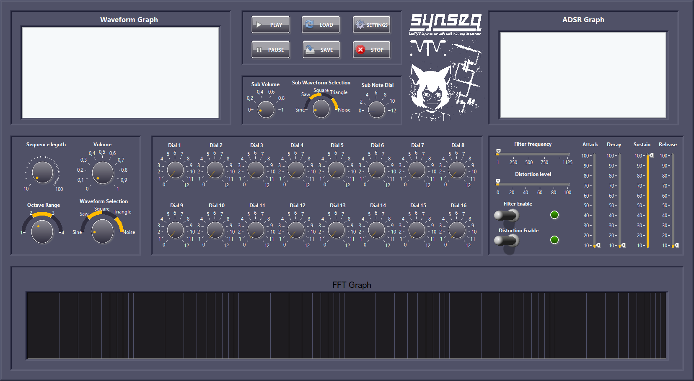
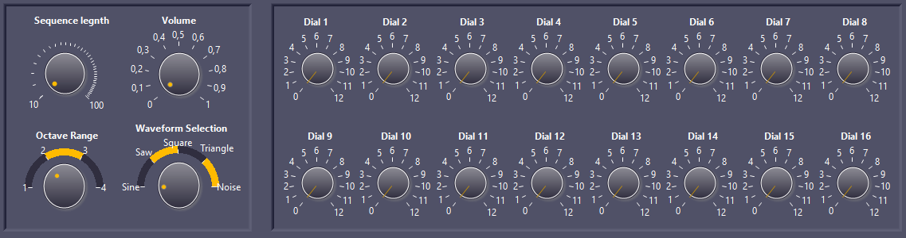
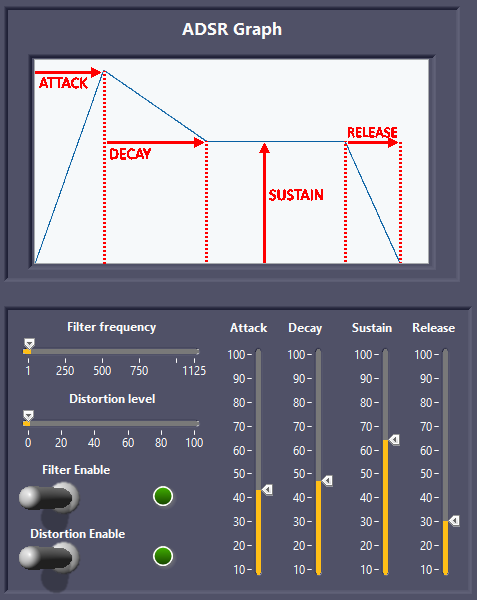
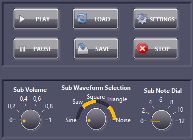

Projekt zrealizowany w ramach zajęć "Podstawy Graficznych Języków Programowania"; MTM 2025; AGH;
 
last edited 27.01.2025

# SynSeq

SynSeq - LabVIEW Synthesizer with built in 16-step Sequencer

SynSeq is a standalone LabVIEW based sequencer-synthesizer with built-in ADSR Envelope Generator, 16-step sequencer regulated with knobs that allow user to use microtonal music sequeces and fully explore his creative potential.

The design was heavily inspired by KORG SR-1, KORG Volca series, Arturia products, old-school Roland drum machines and the modular diy eurorack-compatible synthesizer scene.

# CONTROLS AND INDICATORS LIST

The program uses 9 custom SubVI's:
- ADSR_Envelope_Generation_subVI;
- FrequencyArrayToHz_SubVI;
- Distortion_SubVI;
- Filter_SubVIv;
- Settings_SubVI;
- Pitch_LFO_SubVI;
- FFTCalc_SubVI;
- Waveform_Generation_SubVI;
- WaveformBuffer_SubVI;
	

Front panel is equipped with several Waveform graphs:
- graph of ADSR Envelope;
- current waveform graph;
- Fast Fourier Transform graph of the currently played note.

Controls for the sequencer are as listed:
- 16 knobs for all of the steps of the sequencer;
- volume knob;
- sequence legnth knob;
- octave range knob;
- waveform selection;
- 4 sliders that control ADSR envelope generation;
- lowpass filter slider;
- lowpass filter enable switch;
- distortion slider;
- distortion  enable switch;
- "PLAY", "PAUSE", "LOAD", "SAVE", "SETTINGS", "STOP" buttons.

# SIMPLE OVERVIEW

## INTRODUCTION:
Using SynSeq is very simple. The user first enters the settings for his session in the "Settings" panel.
After confirming chosen settings the user is taken to the main Front panel where the parameters of the sequence can be chosen.

## SIMPLE SEQUENCE GENERATION:
All of 16 dials represent notes that are going to be played sequentialy from 1 to 16.
They are programmed in such a way that the positions 0 to 12 represent all the notes of one octave.
Octave can be regulated by the "Octave Range" dial. Snapping is turned off which means that the user ia able to input microtonal note sequences.
Sequence length as the name suggests regulates the time of each sequence.
Waveform selects the waveform to be played. Notes are being read and generated on the fly so the user can input changes and hear them on the go.

## ADSR ENVELOPE GENERATION MENU:
Attack, Decay, Sustain and Release control the envelope generation, which is displayed on the ADSR graph.
Attack, Decay and Release are "time" parameters, whereas Sustain is a "level" parameter.

## LOWPASS FILTER MENU:
Lowpass filter is turned on by the "Filter Enable" switch.
Slider "Filter frequency" changes the -3dB frequency. Upper limit is dynamically changed based on the sampling frequency.

## DISTORTION MENU:
Distorion clipping is turned on by the Distorion Enable" switch.
"Distortion level" slider changes the clipping threshold. IT also lowers the volume.

## GRAPHS:
There are currently three graphs on the Front Panel;
"ADSR Graph" shows the current envelope.
"Waveform Graph" shows the current Waveform being played with all the effects added.
"FFT Graph" shows the Fourier Transform graph of the currently played waveform.

## SUB OSCILATOR:
Suboscilator can be configured using three dials;
"Sub Waveform Selection" changes the waveform of the sub.
"Sub Note Dial" changes the frequency of the subOSC. (0 - one actave below the note played, 12- the note being played by the main oscilator)
"Sub Volume" changes the volume of the suboscilator.

## BUTTONS MENU:
Buttons menu is equipped with 6 buttons
"PLAY" and "PAUSE" buttons are responsible for playing the sequence.
"LOAD" and "SAVE" buttons are responsible for saving and loading sequences. They use an array of 17 elements (16 for the notes frequencies and 1 for the octave range).
"SETTINGS" button can be used to change the sample rate and device ID.
"STOP" stops the execution of the whole programme.
